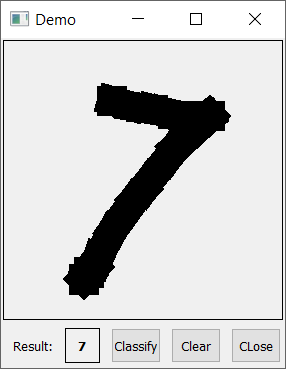

# MNIST_TF_GUI README File
Author: Caihao Cui
Location: Melbourne, VIC, AU.

Description: This repository demonstrates one python program including training, testing, and retraining ML/DL models with TensorFlow and Keras with an extra GUI by Qt5.
 
## Check the input images

Sample Images:

## Reference
This repository is inspried by the CSDN Blog: https://blog.csdn.net/u011389706/article/details/81460820.